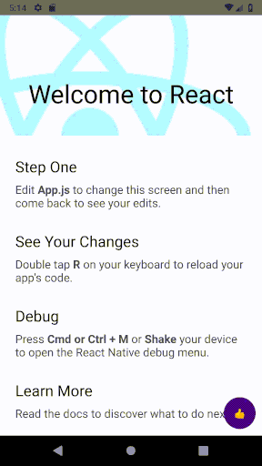

# React Native Animated Absolute Buttons
Animated absolute buttons that you can position anywhere on the screen. Feel free to use.

Example One             |  Example Two
:-------------------------:|:-------------------------:
 | 

## Installation

```
npm install react-native-animated-absolute-buttons
```

## Documentation

| Prop  | Description  | Type  | Default  | Required  |
|---|---|---|---|---|
| buttonSize | Size of the main button. | number | 50 | **NO** |
| buttonColor | Color of the main button. | string | 'indigo' | **NO** |
| buttonShape | Shape of the main button. ('circular', 'rounded', 'square') | string | 'circular' | **NO** |
| buttonContent | Content of the main button. | any (text, icon component etc.) | - | **YES** |
| direction | The direction in which the buttons will open (top, bottom, left, right) | string | 'top' | **NO** |
| position | Position of all buttons (top-left, top-right, bottom-left, bottom-right) | string | 'bottom-right' | **NO** |
| positionVerticalMargin | Vertical distance in the position of the buttons | number | 10 | **NO** |
| positionHorizontalMargin | Horizontal distance in the position of the buttons | number | 10 | **NO** |
| time | Time to open buttons (animation time) | number | 500 | **NO**  |
| easing | Animation easing [Please read](https://reactnative.dev/docs/easing) | string | 'Linear' | **NO**  |
| buttons | Buttons (Detailed explanations are below) | array | - | **YES**  |

Props table for buttons array:

| Prop | Description | Type | Default | Required |
|---|---|---|---|---|
| color  | Color of the button. | string | -  | **YES** |
| content  | Content of the button. | any | - | **YES** |
| action  | Function of the button. | function | -  | **YES** |

### Usage

```
const buttons = [
    {
        color: 'blue',
        content: <Text>👊</Text>,
        action: () => {
            alert("You clicked!");
        }
    },
    {
        color: 'red',
        content: <Text>🤙</Text>,
        action: () => {
            alert("You clicked!");
        }
    },
    {
        color: 'green',
        content: <Text>👋</Text>,
        action: () => {
            alert("You clicked!");
        }
    },
];

<AnimatedAbsoluteButton
    buttonSize={50}
    buttonColor='indigo'
    buttonShape='circular'
    buttonContent={<Text>👍</Text>}
    direction='top'
    position='bottom-right'
    positionVerticalMargin={10}
    positionHorizontalMargin={10}
    time={500}
    easing='bounce'
    buttons={buttons}
/>
```
